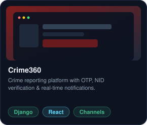
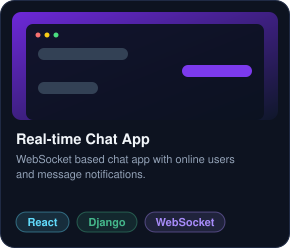
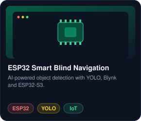
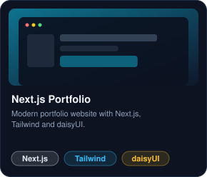
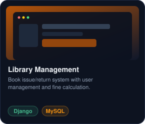

# 👋 Hi, I'm Shorafot Hoshen

### Full-Stack Developer | CSE Student

  

 

## 🛠️ Tech Stack

**Languages** 
  

**Frontend** 
  

**Backend** 
  

**Database** 
  

**Mobile (React Native)** 
  

**Tools** 

  

## 📁 Featured Projects

<a href="https://github.com/shorafothoshen?tab=repositories"><b>View all projects →</b></a>

  

## 📊 GitHub Stats

 

## 🧩 Problem Solving

